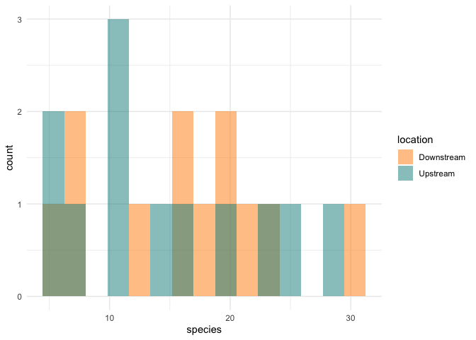
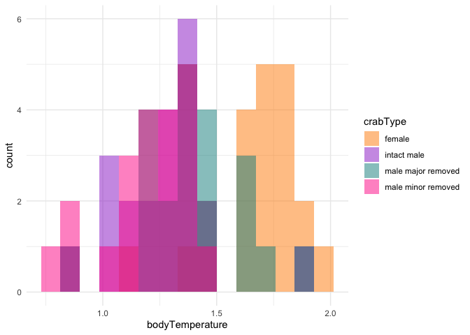

Lab 6 Comparing two means
================
Kelsey Leach
2021-04-27

Researchers studying the number of electric fish species living in
various parts of the Amazon basin were interested in whether the
presence of tributaries affected the local number of electric fish
species in the main rivers (Fernandes et al. 2004).

They counted the number of electric fish species above and below the
entrance point of a major tributary at 12 different river locations.

The data is provided in your GitHub repository.

For each question below, write a sentence answering the question and
show the code you used to come up with the answer, if applicable.

## Question A

> What is the mean difference in the number of species between areas
> upstream and downstream of a tributary? What is the 95% confidence
> interval of this mean difference. Show your code and write a sentence
> giving your answer

The mean difference in the number of species between the areas is
1.83334 and the 95% confidence interval is -4.587031 to 8.253697.

``` r
t.test(formula = species ~ location, data = fish_long)
```

    ## 
    ##  Welch Two Sample t-test
    ## 
    ## data:  species by location
    ## t = 0.59249, df = 21.81, p-value = 0.5596
    ## alternative hypothesis: true difference in means is not equal to 0
    ## 95 percent confidence interval:
    ##  -4.587031  8.253697
    ## sample estimates:
    ## mean in group Downstream   mean in group Upstream 
    ##                 16.41667                 14.58333

## Question B

> Test the hypothesis that the tributaries have no effect on the number
> of species of electric fish.

We fail to reject the null hypothesis the the tributaries have no effect
on the number of species of electric fish. This is because the
difference between the two locations is not statistically significant (p
\> 0.05).

``` r
t.test(formula = species ~ location, data = fish_long)
```

    ## 
    ##  Welch Two Sample t-test
    ## 
    ## data:  species by location
    ## t = 0.59249, df = 21.81, p-value = 0.5596
    ## alternative hypothesis: true difference in means is not equal to 0
    ## 95 percent confidence interval:
    ##  -4.587031  8.253697
    ## sample estimates:
    ## mean in group Downstream   mean in group Upstream 
    ##                 16.41667                 14.58333

## Question C

> State the assumptions that you had to make to complete parts (A) and
> (B). Create a graph to assess whether one of those assumptions was
> met.

When performing a two-sample t-test, we assumed the measurements were
taken from a random sample, the number of species is normally
distributed, and the standard deviation of the number of species is the
same in both samples. From the graph below, it does not appear that the
normal distribution assumption was fulfilled.

``` r
fish_long %>% 
  ggplot(aes(x = species)) +
  geom_histogram(
    aes(fill = location), 
    bins = 15, 
    alpha = 0.5, 
    position = "identity"
  ) +
  #scale_fill_manual(values = c("darkorange","cyan4")) +
  theme_minimal()
```

<!-- -->

## ANOVA

Fiddler crabs are so called because males have a greatly enlarged
“major” claw, which is used to attract females and to defend a
burrow.

Darnell and Munguia (2011) recently suggested that this appendage might
also act as a heat sink, keeping males cooler while out of the burrow on
hot days.

To test this, they placed four groups of crabs into separate plastic
cups and supplied a source of radiant heat (60-watt light bulb) from
above. The four groups were intact male crabs, male crabs with the major
claw removed; male crabs with the other (minor) claw removed (control);
and intact female fiddler crabs.

They measured the body temperature of crabs every 10 minutes for 1.5
hours. These measurements were used to calculate a rate of heat gain for
every individual crab in degrees C/log minute. Rates of heat gain for
all crabs are provided in the accompanying data file.

### Question D

Graph the distribution of body temperatures for each crab type:

``` r
crab <- read_csv("chap15q27FiddlerCrabFans.csv")
```

    ## 
    ## ── Column specification ────────────────────────────────────────────────────────
    ## cols(
    ##   crabType = col_character(),
    ##   bodyTemperature = col_double()
    ## )

``` r
crab <- na.omit(crab)
crab %>% 
  ggplot(aes(x = bodyTemperature)) +
  geom_histogram(
    aes(fill = crabType), 
    bins = 15, 
    alpha = 0.5, 
    position = "identity",
    na.rm = TRUE
  ) +
  scale_fill_manual(values = c("darkorange", "darkorchid", "cyan4", "deeppink")) +
  theme_minimal()
```

<!-- -->

### Question E

Does body temperature varies among crab types? State the null and
alternative hypothesis, conduct an ANOVA, and interpret the results.

The null hypothesis is that mean body temperature is equal between the
crab types. The alternative hypothesis is that mean body temperature is
different in at least one crab type. We reject the null hypothesis and
accept the alternative hypothesis (p\<0.05). There is a statistically
significant difference between the mean body temperature in at least one
of the crab types and the mean body temperature of the other types.

``` r
aov_crab_claw <-
  aov(bodyTemperature ~ crabType, data = crab)
aov_crab_claw
```

    ## Call:
    ##    aov(formula = bodyTemperature ~ crabType, data = crab)
    ## 
    ## Terms:
    ##                 crabType Residuals
    ## Sum of Squares  2.641310  3.467619
    ## Deg. of Freedom        3        80
    ## 
    ## Residual standard error: 0.2081952
    ## Estimated effects may be unbalanced

``` r
summary(aov_crab_claw)
```

    ##             Df Sum Sq Mean Sq F value Pr(>F)    
    ## crabType     3  2.641  0.8804   20.31  7e-10 ***
    ## Residuals   80  3.468  0.0433                   
    ## ---
    ## Signif. codes:  0 '***' 0.001 '**' 0.01 '*' 0.05 '.' 0.1 ' ' 1
